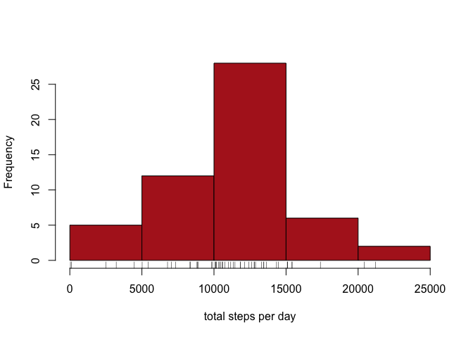
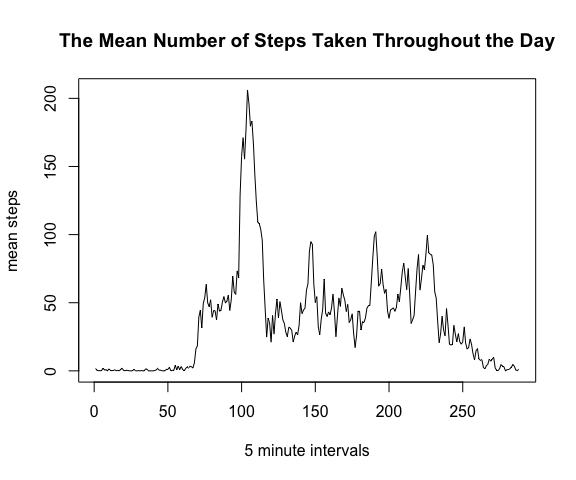
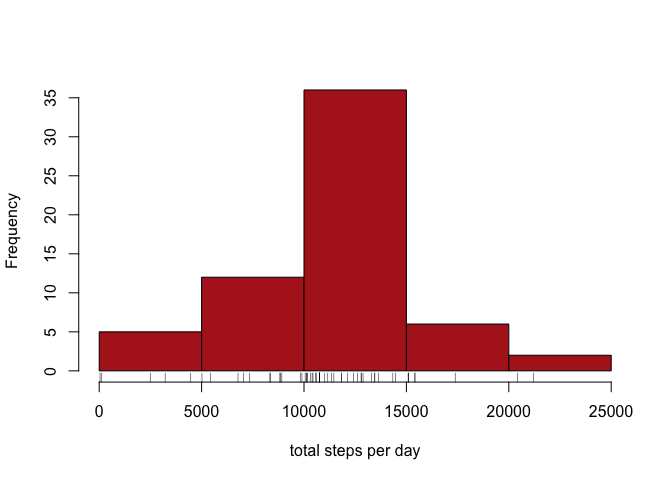
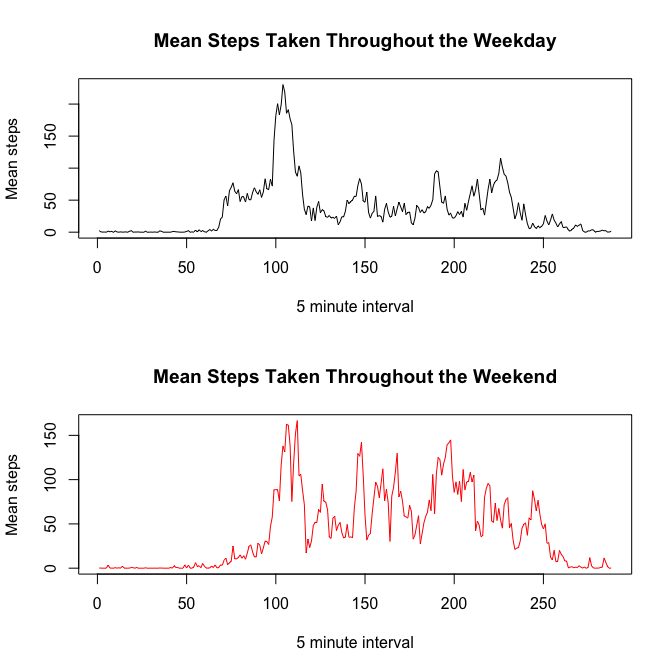

## Loading and preprocessing the data

Unzipping and reading in the data:  


```r
unzip("activity.zip")
act_df <- read.csv(  "activity.csv"  ,  header = TRUE , colClasses = c("integer","factor","integer") )
```

Now preprocessing the data (using lubridate)  

```r
library(lubridate)
act_df$date <- parse_date_time(  act_df$date  ,  orders = "%y%m%d"  )
```


## What is mean total number of steps taken per day?
Splitting the data by the date then summing the steps per 5 minutes


```r
act_day <- split(act_df$steps, act_df$date)
total_steps_day <- sapply(act_day, sum)
```

histogram of the total steps per day  


```r
hist(total_steps_day, breaks = 7,
     main = NULL,
     xlab = "total steps per day",
     col = "firebrick"
)
rug(total_steps_day)
```

<!-- -->

Finding the mean and median steps per day  


```r
mean_steps_day <- mean(total_steps_day, na.rm = T)
median_steps_day <- median(total_steps_day, na.rm = T)
```

*mean number of steps per day:* **1.0766189\times 10^{4}**  
*median number of steps per day:* **10765**  


## What is the average daily activity pattern?

splitting the data set by the minutes, then plotting the average for each interval.  


```r
act_int <- split(act_df$steps, act_df$interval)
mean_steps_int <- sapply(act_int, mean, na.rm = TRUE)
plot(mean_steps_int, type = "l",
     ylab = "mean steps", xlab = "5 minute intervals",
     main = "The Mean Number of Steps Taken Throughout the Day"
)
```

<!-- -->


now finding the maximum value and the associated interval:

```r
maxcon <- mean_steps_int == max(mean_steps_int, na.rm = T)
names(mean_steps_int[maxcon])
```

```
## [1] "835"
```

Therefore 835 or 8:35 is on average the most active interval  


## Imputing missing values

first checking for NAs in the date and interval columns:

```r
sum(is.na(act_df$date))
```

```
## [1] 0
```

```r
sum(is.na(act_df$interval))
```

```
## [1] 0
```
Implying there are none.  

Now checking the steps data column:

```r
sum(is.na(act_df$steps))
```

```
## [1] 2304
```
So there are 2304 missing values, or as a percentage of the recorded observations: **13.1147541%**

Strategy to fill the NA step values will be to use the mean of the 5 minute interval associated with that observation.


```r
NArpl_df <- act_df # Copy data frame to fill
mean_steps_df <- data.frame(meanSteps = mean_steps_int,
                            interval = as.integer(names(mean_steps_int))
) #attaching mean_steps_int colnames as data column


for (int5 in mean_steps_df$interval) { # loops over the intervals
  
  na_rows <- is.na(NArpl_df$steps) # finds NA step values
  int_row <- NArpl_df$interval == int5 # finds interval rows to replace
  print( which(na_rows&int_row) ) # prints the rows it will replace
  
  meanIntRow <- mean_steps_df$interval == int5 # identifies mean replacement row
  print(paste("mean:",which(meanIntRow))) # prints to check code runs nicely
  NArpl_df[which(na_rows&int_row),"steps"] <- mean_steps_df[meanIntRow,"meanSteps"]
  
}
```

Now data frame `NArpl_df` is an NA filled (by interval mean) version of the original data.  

Now generating the total steps per day as previously:

```r
NA_rpl_day <- split(NArpl_df$steps, NArpl_df$date)
total_steps_day_NA <- sapply(NA_rpl_day, sum)
```

Now producing the histogram plot with the NA replaced data 

```r
hist(total_steps_day_NA, breaks = 7,
     main = NULL,
     xlab = "total steps per day",
     col = "firebrick"
)
rug(total_steps_day_NA)
```

<!-- -->

Investigating the impact that NA replacement has has on the mean and median.

```r
mean_steps_day_NA <- mean(total_steps_day_NA)
median_steps_day_NA <- median(total_steps_day_NA)
mean_steps_day_NA # new mean
```

```
## [1] 10766.19
```

```r
median_steps_day_NA # new median
```

```
## [1] 10766.19
```

Mean change due to NA replacement: **0**  
Median change due to NA replacement: **-1.1886792**


## Are there differences in activity patterns between weekdays and weekends?


Creating factor variable appended to NA replaced data frame using the chron package.

```r
library(chron)
```

```
## NOTE: The default cutoff when expanding a 2-digit year
## to a 4-digit year will change from 30 to 69 by Aug 2020
## (as for Date and POSIXct in base R.)
```

```
## 
## Attaching package: 'chron'
```

```
## The following objects are masked from 'package:lubridate':
## 
##     days, hours, minutes, seconds, years
```

```r
NArpl_df$weekday <- as.factor(ifelse(is.weekend(NArpl_df$date), "Weekend","Week Day"))
```


Subsetting the data by week vs weekend: then finding the 5 minute averages

```r
WKDY_df <- subset(NArpl_df, weekday == "Week Day")  # Separating the data by weekday/weekend
WKND_df <- subset(NArpl_df, weekday == "Weekend")

WKDY_int <- split(WKDY_df$steps,WKDY_df$interval)  # splitting both data frames by the 5 minute intervals
WKND_int <- split(WKND_df$steps,WKND_df$interval)

WKDY_int_mean <- sapply(  WKDY_int , mean  )  # calculating the means of the 5 minute intervals
WKND_int_mean <- sapply(  WKND_int , mean  )
```

Plotting the 5 minute intervals for the weekend and weekday data

```r
par(mfrow = c(2,1))
plot(WKDY_int_mean, type = "l",
     xlab = "5 minute interval",ylab = "Mean steps",
     main = "Mean Steps Taken Throughout the Weekday"
     )
plot(WKND_int_mean,type = "l", col = 2,
     xlab = "5 minute interval",ylab = "Mean steps",
     main = "Mean Steps Taken Throughout the Weekend"
     )
```

<!-- -->

